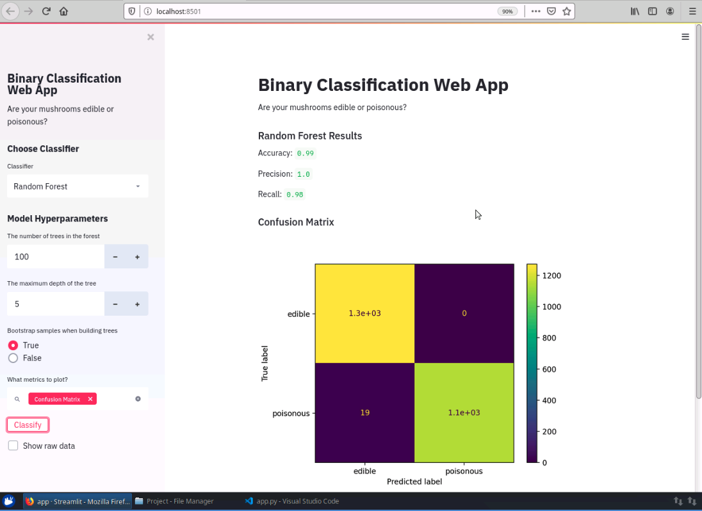

# practice-streamlit-ml

A mini project to try building a machine learning web app using Streamlit.

Through the web app. the user is able to change the parameters of three different models (Logistic Regression, SVM, and Random Forest) without having to write any code. The problem at hand is to classify mushrooms as edible or not.

This is a hands-on project that I completed on Coursera's project network: https://www.coursera.org/projects/machine-learning-streamlit-python

## Screenshots

